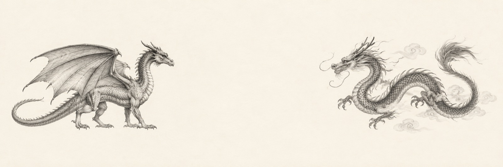
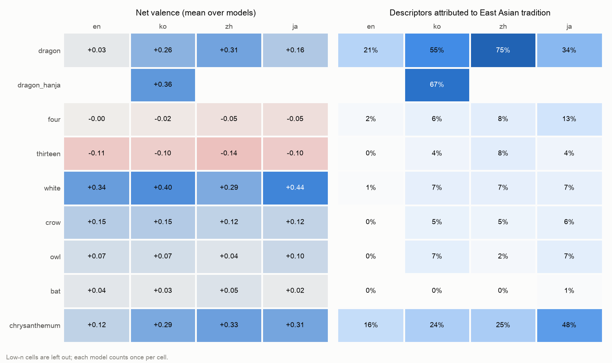

# dragon-bench



What does a language model say when it is given nothing but `Dragon is` — and does the answer change when the same stem is written in Korean, Chinese or Japanese?

## Purpose

- **Measure the default.** Each model gets a bare subject stem (`Dragon is` / `용은` / `龙是` / `竜は`) as the whole user message, with no instruction, persona or cultural frame. Whatever comes back is the model's unprompted association.
- **Compare languages.** The dragon is the first probe because its connotation flips between traditions: auspicious, royal and tied to water in East Asia; monstrous, fiery and hoarding in Europe. Seven more stems said to split the same way follow: 4, 13, white, crow, owl, bat, chrysanthemum.
- **Keep it measurable.** Answers are filtered and normalised afterwards rather than constrained up front. Every descriptor is a verified span of the answer, mapped to a shared English concept, tagged with the tradition the answer attributes it to, and scored positive / neutral / negative.

## Findings

8 models (GPT, Claude, Gemini, Llama, Mistral, DeepSeek, Qwen, Solar) × 4 languages. The dragon used 100 samples per model and language; the other stems are a 20-sample screening.

| Stem | What we saw |
|---|---|
| Dragon | **The prompt language picks the tradition.** East Asian descriptors: 21% en, 34% ja, 55% ko, 75% zh. Net valence: +0.03 en, +0.16 ja, +0.26 ko, +0.31 zh. English is the least positive language for all 8 models. English answers lead with fire, wings and "mythical creature"; Chinese answers with power, luck and royalty. |
| 용(龍)은 | Adding 龍 removes the misreadings of `용은` (a given name, 용도); DeepSeek's Korean replies go from 6% to 100%. But 龍 is itself a cue: East Asian descriptors 55% → 67%, valence +0.26 → +0.36. |
| 13 | **Does not move with language.** "Unlucky" appears in 59–64% of answers in every language, so the Western superstition carries into Korean, Chinese and Japanese. |
| 4 | Mostly arithmetic everywhere. "Unlucky" is 7% in English against 15–22% in Korean, Chinese and Japanese. |
| White | Purity in 68–78% of answers everywhere. Mourning: 40% zh, 22% ko, 14% en, 9% ja. |
| Chrysanthemum | Botany in English (+0.12), symbolism in Korean, Chinese and Japanese (+0.29 … +0.33). The imperial crest appears in 69% of Japanese answers. Mourning is 26% en and 6% zh. |
| Crow, owl, bat | Answered as zoology in every language; cultural readings are thin. Bat as 福 (fortune) shows up in about 2% of answers, even in Chinese. Owl as good fortune: 16% ko, 25% ja, 0% zh. |



Full table with stems and top concepts per language: [`data/overview/overview.md`](data/overview/overview.md). Per-run reports, heatmaps and raw responses are in [`data/runs/`](data/runs/) (e.g. [`v1/report/report.md`](data/runs/v1/report/report.md)).

The extractor was checked against 64 responses labelled blind (by Claude, not by a human). Concept precision was 0.82 and recall 0.69, tradition labels agreed 94% of the time, and per-language net valence on both sides kept English lowest.

## How it works

1. **collect** — the stem as the only user message, through OpenRouter at temperature 1.0, with reasoning off where the endpoint allows it. Runs can be resumed, and each run holds one subject (`config.SUBJECTS`).
2. **extract** — answers in a language other than the stem's are counted and then excluded. An extractor model (`google/gemini-2.5-flash-lite`, JSON schema) labels the response type, whether the answer is about the subject at all, and up to 30 descriptors (exact span, native lemma, English concept, eastern / western / general). A taxonomy model (`google/gemini-3.8-flash`) merges near-synonyms into canonical concepts and labels their valence; hand corrections in `taxonomy.json` are never overwritten.
3. **report** — per model × language: filtering funnel, net valence, tradition split and concept heatmaps. Cells with fewer than 10 usable responses are masked.
4. **validate / overview** — a blind stratified sample compared against the extractor, and a cross-run summary per stem × language.

```bash
export OPENROUTER_API_KEY=...        # never commit it
uv run dragon-bench collect v1 --samples 100            # --subject dragon is the default
uv run dragon-bench extract v1
uv run dragon-bench report v1
uv run dragon-bench collect crow --subject crow --samples 20
uv run dragon-bench validation-sample v1                # then write validation/labels.jsonl
uv run dragon-bench validate v1
uv run dragon-bench overview v1 dragon-hanja crow
```

`collect` accepts `--models` and `--langs` to run a subset. Outputs land in `data/runs/<run>/` (`responses.jsonl`, `extractions.jsonl`, `taxonomy.json`, `report/`, `validation/`); the overview goes to `data/overview/`.

## Caveats

- Concept tags and valence labels are model judgements, and the extractor and taxonomy models are Google models. Each `taxonomy.json` has been reviewed (by Claude), and the edits are recorded in its `review` key. Facts, abilities, uses, power and authority count as neutral, because the same words describe monsters and emperors; stated benefits to people count as positive.
- The descriptor cap was 15 at first. That truncated answers that describe one tradition after the other: English answers lost their eastern part, Chinese answers their western part. The cap is now 30.
- The 20-sample stems give roughly ±10-point shares per cell; compare languages on the means over models.
- Concept shares are per response (presence), so a long answer counts the same as a short one.
